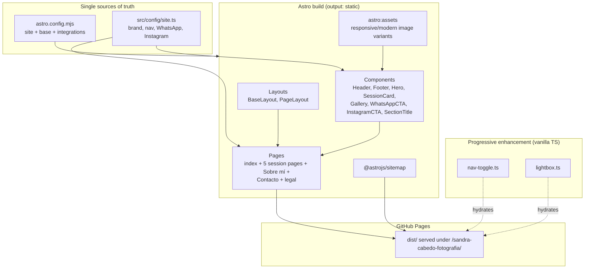
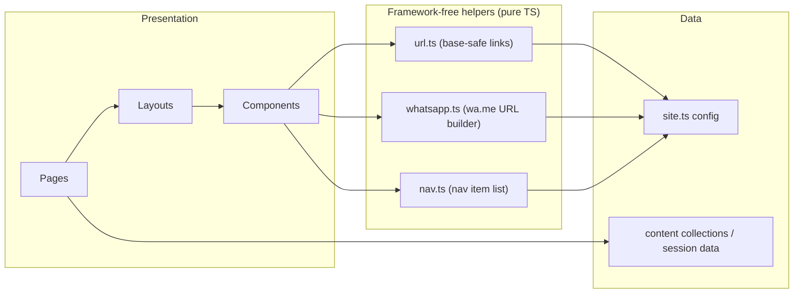
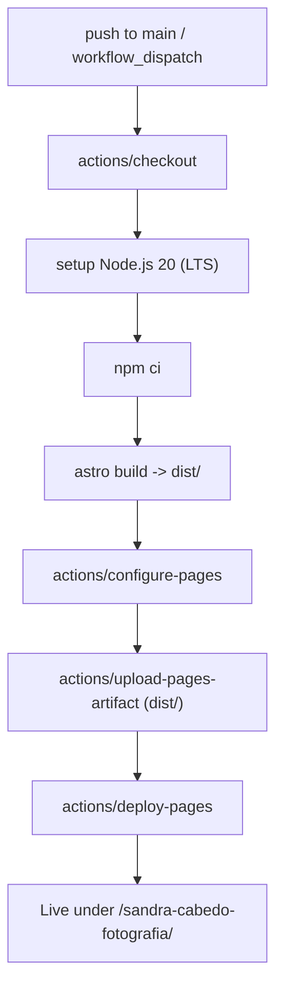

# Design Document

## Overview

This document defines the technical design for the first functional demo of the **Sandra
Cabedo Fotografía** website: a modern, warm, highly visual static site for a photographer
specialized in family, children, newborn, pregnancy, and communion photography in Castellón
(Spain).

The site is built with **Astro** and output as a fully **static** site (`output: 'static'`),
deployed to **GitHub Pages under the subpath** `/sandra-cabedo-fotografia/`, with a designed
one-line migration path to the custom domain `sandracabedofotografia.es`. There is no
backend and no contact form: conversion is channeled entirely through WhatsApp. All user
interface content is written in **Spanish**; this design document is written in English.

The design is driven by a small number of load-bearing decisions:

1. **Photography is the protagonist.** The visual system (palette, type, whitespace, layout)
   is deliberately quiet so photographs carry the emotional weight. This is enforced through
   design tokens and layout rules, not ad-hoc styling.
2. **A single source of truth for configuration.** `astro.config.mjs` owns `site`/`base`;
   `src/config/site.ts` owns brand data, navigation, WhatsApp and Instagram config. No
   component ever hardcodes the deployment subpath or the phone number.
3. **Base-safe URLs everywhere.** Every internal link and asset URL is built through a small
   set of helpers layered on `import.meta.env.BASE_URL`, so switching from the GitHub Pages
   subpath to a root custom domain is a two-value change.
4. **No framework runtime.** No React. Interactivity (mobile menu, lightbox) is implemented
   with small, progressively-enhanced vanilla TypeScript modules.
5. **Astro-native image optimization.** `astro:assets` (`<Image>`/`<Picture>`) provides
   responsive sizes, modern formats, explicit dimensions (no layout shift), and correct
   lazy/eager loading.

### Goals

- Demonstrate the aesthetic direction with placeholder content that can be swapped for real
  content with minimal edits.
- Establish a clean, extensible technical foundation for the definitive project.
- Meet WCAG AA, strong Core Web Vitals, and initial SEO out of the box.
- Deploy automatically on every push to `main` via GitHub Actions.

### Non-Goals (this version)

- No backend, no contact form, no Instagram API integration.
- No CMS. Content lives in typed config/content collections and placeholder images.
- No analytics or third-party trackers.

### Requirements Coverage Map

| Area | Requirements |
| --- | --- |
| Visual identity / tokens | 1, 5, 6, 7 |
| Responsive / mobile-first | 2 |
| Navigation & structure | 3, 6.8 |
| Home sections (Hero, Presentation, Sessions, Children, Instagram, Contact) | 4, 5, 6, 7, 9, 11 |
| Portfolio & lightbox | 8 |
| WhatsApp conversion | 10 |
| Footer & privacy/location | 12, 13 |
| Astro architecture & components | 14 |
| Image optimization | 15 |
| SEO | 16 |
| Accessibility & performance | 17 |
| GitHub Pages base handling | 18 |
| Deployment workflow | 19 |
| Documentation & build verification | 20 |

## Architecture

### High-level architecture

The site is a static Astro project. At build time, Astro renders pages to HTML, optimizes
images, generates the sitemap, and emits `dist/`, which GitHub Pages serves under the
configured base path. The only client-side JavaScript is two tiny enhancement modules
(mobile navigation and lightbox).



### Rendering model

- **Static generation.** Every page is prerendered to HTML. No SSR, no adapters.
- **Islands of interactivity, without a UI framework.** The mobile menu and the lightbox are
  standalone `<script>` modules (TypeScript, bundled by Astro/Vite). They are attached only
  when the corresponding markup exists, and they degrade gracefully: links and images remain
  fully usable with JavaScript disabled (the lightbox simply does nothing; images stay
  inline and navigable).
- **No hydration cost from a framework.** This keeps the JavaScript payload minimal, which
  directly supports Requirement 17.5 (Core Web Vitals) and Requirement 15 (performance).

### Layered responsibilities



The pure helpers (`url.ts`, `whatsapp.ts`, `nav.ts`) contain the only logic worth testing in
isolation and are the basis for the correctness properties later in this document.

## Components and Interfaces

### Project structure

```
sandra-cabedo-fotografia/
├── .github/
│   └── workflows/
│       └── deploy.yml                 # GitHub Actions: build + deploy to Pages
├── assets/
│   └── images/
│       └── mocks/                     # mock-01.jpg .. mock-20.jpg (+ README)
├── public/
│   └── robots.txt                     # references sitemap URL (site absolute)
├── src/
│   ├── config/
│   │   └── site.ts                    # SiteConfig, WhatsAppConfig, nav, Instagram, brand
│   ├── lib/
│   │   ├── url.ts                     # base-safe link/asset helpers
│   │   ├── whatsapp.ts                # WhatsApp URL builder + enabled() guard
│   │   └── nav.ts                     # returns the 8 nav items
│   ├── content/
│   │   ├── config.ts                  # content collections schema (sessions)
│   │   └── sessions/                  # one entry per session type (front-matter + copy)
│   ├── images/
│   │   └── mocks/                     # imported placeholders for astro:assets (Image)
│   ├── layouts/
│   │   ├── BaseLayout.astro           # <head>, SEO, skip link, landmarks, global CSS
│   │   └── PageLayout.astro           # BaseLayout + Header + Footer + <main>
│   ├── components/
│   │   ├── Header.astro
│   │   ├── Footer.astro
│   │   ├── Hero.astro
│   │   ├── SessionCard.astro
│   │   ├── Gallery.astro
│   │   ├── WhatsAppCTA.astro
│   │   ├── InstagramCTA.astro
│   │   ├── SectionTitle.astro
│   │   └── Seo.astro                  # head tags (title/meta/canonical/OpenGraph)
│   ├── scripts/
│   │   ├── nav-toggle.ts              # collapsible mobile menu
│   │   └── lightbox.ts                # accessible vanilla lightbox
│   ├── styles/
│   │   ├── tokens.css                 # design tokens (custom properties)
│   │   ├── base.css                   # reset, elements, typography, a11y
│   │   └── utilities.css              # layout helpers (container, section, grid)
│   └── pages/
│       ├── index.astro                # Inicio (Home_Page)
│       ├── newborn.astro
│       ├── familia.astro
│       ├── crecer-juntos.astro
│       ├── embarazo.astro
│       ├── sobre-mi.astro             # Sobre mí
│       ├── contacto.astro             # Contacto
│       ├── aviso-legal.astro
│       └── politica-de-privacidad.astro
├── astro.config.mjs                   # site + base + @astrojs/sitemap
├── tsconfig.json
├── package.json
└── README.md
```

Notes:

- **`assets/` vs `src/images/`.** The repository already ships placeholders under
  `assets/images/mocks/`. For `astro:assets` optimization the `<Image>` component needs
  imported ESM assets, so the mocks are made available under `src/images/mocks/` (imported in
  code). `assets/` remains the human-facing drop folder; a short note in the README and the
  mocks `README.md` explains the swap. Real photos later replace the same imported files, so
  component code does not change (Requirement 15.6, 15.7).
- **`public/`** holds files copied verbatim (e.g. `robots.txt`). Anything in `public/` is
  served relative to `base`, so `robots.txt` is reachable at `<base>robots.txt`.

### Component catalogue (Reusable_Components — Requirement 14.4)

Each component receives typed `Props`. All internal links come from `url.ts`; all WhatsApp
links come from `whatsapp.ts`; nav comes from `nav.ts`.

#### `SectionTitle.astro`
Editorial section heading with the serif family. Renders the correct heading level so pages
keep a valid H1/H2/H3 hierarchy (Requirement 16.3).

```ts
interface SectionTitleProps {
  as?: 'h1' | 'h2' | 'h3';   // default 'h2'
  eyebrow?: string;          // optional small label above the title
  align?: 'start' | 'center';
}
```

#### `Header.astro`
Textual logo "Sandra Cabedo Fotografía" (Requirement 3.1) plus the eight-item navigation
(Requirement 3.2). Highlights the active section via `aria-current="page"` (Requirement 3.3).
Renders a collapsible menu with an accessible toggle button for viewports ≤768px
(Requirement 3.6); enhanced by `nav-toggle.ts`.

```ts
interface HeaderProps {
  activePath: string;        // Astro.url.pathname, used to mark aria-current
}
```

#### `Footer.astro`
Displays brand line and "Fotografía familiar · Castellón", Instagram + WhatsApp links, legal
links, and copyright; omits any physical address (Requirement 12, 13.3).

```ts
interface FooterProps { /* no props; reads site config */ }
```

#### `Hero.astro`
Large emotional family photograph (eager-loaded), short headline, subtitle, and a primary
WhatsApp CTA "Reserva tu sesión" (Requirement 4).

```ts
import type { ImageMetadata } from 'astro';
interface HeroProps {
  image: ImageMetadata;      // imported asset for astro:assets <Image>
  alt: string;
  title: string;             // e.g. "Fotografías de vuestra historia"
  subtitle: string;
}
```

#### `SessionCard.astro`
Visual card for a session category, linking to its page/gallery (Requirement 6.1, 6.8).

```ts
import type { ImageMetadata } from 'astro';
interface SessionCardProps {
  slug: string;              // used with url.ts to build the link
  title: string;             // "Newborn", "Familia", ...
  description: string;
  coverImage: ImageMetadata;
  coverAlt: string;
}
```

#### `Gallery.astro`
Editorial masonry mixing vertical and horizontal images (Requirement 8.1, 8.2), with light
hover zoom and lightbox triggers (Requirement 8.3, 8.4).

```ts
interface GalleryProps {
  images: GalleryImage[];    // see Data Models
  columns?: { base: number; md: number; lg: number };
}
```

#### `WhatsAppCTA.astro`
Renders a WhatsApp link/button. Label is constrained to the allowed set. The `href` is built
by `whatsapp.ts`; if the number is empty the control is rendered disabled and inert
(Requirement 10.6). Opens in a new tab (Requirement 10.2). Never renders the phone number as
text (Requirement 10.5).

```ts
type WhatsAppLabel =
  | 'Reserva tu sesión'
  | 'Hablemos'
  | 'Consultar disponibilidad'
  | 'Hablemos por WhatsApp';
interface WhatsAppCTAProps {
  label: WhatsAppLabel;
  variant?: 'primary' | 'secondary';
}
```

#### `InstagramCTA.astro`
Link to the official Instagram profile with a configurable label (Requirement 9.2, 11.4).

```ts
interface InstagramCTAProps {
  label: string;             // e.g. "Sígueme en Instagram", "Instagram"
  variant?: 'primary' | 'secondary';
}
```

#### `Seo.astro`
Prop-driven `<head>` fragment: title, meta description, canonical, and OpenGraph tags,
consumed by `BaseLayout` (Requirement 16.1).

```ts
interface SeoProps {
  title: string;
  description: string;
  path: string;              // page path, canonical/OG url built with site + base
  ogImage?: string;          // optional social image (base-safe url)
}
```

### Layouts

- **`BaseLayout.astro`** — `<html lang="es">`, `<head>` via `Seo.astro`, global CSS imports,
  a skip-to-content link, and the document landmarks. Props: `SeoProps` plus `activePath`.
- **`PageLayout.astro`** — wraps `BaseLayout`, adds `Header`, a `<main id="main">` region for
  the skip link target, and `Footer`. Every page uses `PageLayout` so structure and SEO stay
  consistent.

### Pages and mapping to sections

| Page (clean URL) | Purpose | Key sections/components |
| --- | --- | --- |
| `/` (Inicio / Home_Page) | Aesthetic showcase | Hero, Presentation, Session_Types (5× SessionCard), Children_Experience, Portfolio (Gallery), Instagram_Section, Contact_Section |
| `/newborn/` | Newborn category page | SessionTitle, Gallery, WhatsAppCTA, provisional-content notice |
| `/familia/` | Familia category page | idem |
| `/crecer-juntos/` | Crecer juntos page | idem + concept line "No fotografiar solamente un momento…" |
| `/embarazo/` | Embarazo page | idem |
| `/sobre-mi/` | Sandra presentation | Portrait, warm intro, "Conóceme" context |
| `/contacto/` | Contact_Section | Title "Reserva tu sesión", WhatsApp primary + Instagram secondary |
| `/aviso-legal/` | Legal notice | Static legal text (provisional) |
| `/politica-de-privacidad/` | Privacy policy | Static legal text (provisional) |

Session pages that lack definitive content render a provisional notice plus at least one
sample photograph (Requirement 3.5). If a navigation target cannot be reached, the static
nature of the site means the request 404s at the host; navigation remains visible on every
served page, and internal links are build-validated so they never point at a missing route
(Requirement 3.4, 18.7).

### Configuration and GitHub Pages base handling (Requirement 18)

This is the most important cross-cutting concern. Two locations hold configuration, each
value named once with a single defined value (Requirement 18.6):

**`astro.config.mjs`** owns deployment identity:

```js
import { defineConfig } from 'astro/config';
import sitemap from '@astrojs/sitemap';

// GitHub Pages (subpath) — demo default:
const SITE = 'https://<user>.github.io';
const BASE = '/sandra-cabedo-fotografia/';

// Custom domain (later) — the ONLY change needed:
// const SITE = 'https://sandracabedofotografia.es';
// const BASE = '/';

export default defineConfig({
  site: SITE,
  base: BASE,
  output: 'static',
  trailingSlash: 'always',
  integrations: [sitemap()],
});
```

**`src/config/site.ts`** owns brand/content configuration (nav, WhatsApp, Instagram, brand
strings). It does **not** duplicate `site`/`base`.

**Base-safe URL construction.** All internal URLs are produced by `src/lib/url.ts`, which
composes `import.meta.env.BASE_URL` (Astro injects this from `base`) with the target path.
Components never concatenate paths by hand and never contain the literal
`/sandra-cabedo-fotografia/` (Requirement 18.3, 18.4).

```ts
// src/lib/url.ts
const BASE = import.meta.env.BASE_URL; // e.g. "/sandra-cabedo-fotografia/" or "/"

/** Join base with a site-relative path, collapsing duplicate slashes. */
export function withBase(path: string): string {
  const left = BASE.endsWith('/') ? BASE.slice(0, -1) : BASE;
  const right = path.startsWith('/') ? path : `/${path}`;
  return `${left}${right}` || '/';
}

/** Absolute URL (site + base + path) for canonical/OG/sitemap-style needs. */
export function absoluteUrl(path: string, site: string): string {
  return new URL(withBase(path), site).toString();
}
```

`astro:assets` already resolves imported image URLs against `base` automatically, so
optimized images need no manual prefixing. Files in `public/` are referenced via `withBase`.

**One-line domain switch (Requirement 18.5).** Migrating to `sandracabedofotografia.es`
means editing only `SITE` and `BASE` in `astro.config.mjs` (set `BASE = '/'`). Because every
link and asset is derived from `import.meta.env.BASE_URL`, no component, link, or image needs
editing and all routes stay functional.

**WhatsApp configuration (Requirement 10).** The number and message live only in
`WhatsAppConfig` inside `site.ts`. `whatsapp.ts` builds the `wa.me`/`api.whatsapp.com` URL
with the URL-encoded prefilled message and exposes an `isEnabled()` guard. The phone number
is never rendered as visible text; when empty, CTAs render disabled and inert.

```ts
// src/lib/whatsapp.ts
import { site } from '../config/site';

export function isWhatsAppEnabled(): boolean {
  return site.whatsapp.phone.trim().length > 0;
}

/** Digits-only phone, message URL-encoded exactly as configured. */
export function whatsappUrl(): string | null {
  if (!isWhatsAppEnabled()) return null;
  const phone = site.whatsapp.phone.replace(/\D/g, '');
  const text = encodeURIComponent(site.whatsapp.message);
  return `https://wa.me/${phone}?text=${text}`;
}
```

## Data Models

All data models are TypeScript interfaces. Content that grows (session copy/images) uses an
Astro **content collection**; small, stable configuration uses `site.ts`.

```ts
// src/config/site.ts (types)

export interface NavItem {
  label: string;   // Spanish label shown in the header
  path: string;    // site-relative path, e.g. "/newborn/"
}

export interface WhatsAppConfig {
  phone: string;   // digits, single source of truth; empty string disables CTAs
  message: string; // exact prefilled message (Spanish)
}

export interface InstagramConfig {
  profileUrl: string;   // official profile URL
  handle: string;       // display handle (no phone-like data)
}

export interface BrandConfig {
  name: string;              // "Sandra Cabedo Fotografía"
  tagline: string;           // "Fotografía familiar · Castellón"
  locationLabel: string;     // "Castellón y alrededores"
}

export interface SiteConfig {
  brand: BrandConfig;
  nav: NavItem[];            // exactly the 8 sections
  whatsapp: WhatsAppConfig;
  instagram: InstagramConfig;
}
```

```ts
// src/content/config.ts (session collection schema)
import { defineCollection, z } from 'astro:content';

const sessions = defineCollection({
  type: 'content',
  schema: ({ image }) => z.object({
    slug: z.string(),                 // "newborn", "familia", "crecer-juntos", ...
    title: z.string(),                // "Newborn", "Familia", ...
    description: z.string(),
    coverImage: image(),              // ImageMetadata for astro:assets
    coverAlt: z.string().min(1),      // non-empty alt enforced at build
    images: z.array(z.object({
      src: image(),
      alt: z.string().min(1),
      orientation: z.enum(['portrait', 'landscape']),
    })),
    provisional: z.boolean().default(true),
  }),
});

export const collections = { sessions };
```

```ts
// GalleryImage as consumed by Gallery.astro / lightbox
import type { ImageMetadata } from 'astro';
export interface GalleryImage {
  src: ImageMetadata;               // imported asset (has intrinsic width/height)
  alt: string;                      // required, non-empty (Req 16.4, 17.3)
  width: number;                    // explicit, reserves space (Req 15.4)
  height: number;
  orientation: 'portrait' | 'landscape';
}
```

**Session types (Requirement 6).** The five categories (Newborn, Familia, Crecer juntos,
Embarazo) are content entries. `SessionType` (slug, title, description,
coverImage, images[]) maps 1:1 to the collection schema above; each session page reads its
entry and renders a `Gallery`. The `Crecer juntos` entry carries the concept line "No
fotografiar solamente un momento, sino ver crecer vuestra historia" (Requirement 6.5).

**Placeholder wiring and swap (Requirement 15.6, 15.7).** Placeholders `mock-01.jpg` …
`mock-20.jpg` are imported ESM assets referenced by cover/gallery fields. Because
`astro:assets` derives `width`/`height` from the imported asset, swapping to real photos is
just replacing the image files (or the import paths) — component code and dimensions handling
stay untouched. `orientation` is authored in front-matter so the masonry keeps mixing
vertical and horizontal shots after the swap.

**Navigation (Requirement 3.2).** `nav.ts` returns exactly eight `NavItem`s in order: Inicio,
Newborn, Familia, Crecer juntos, Embarazo, Sobre mí, Contacto. This list is the
single source consumed by `Header` and `Footer`.

## Correctness Properties

*A property is a characteristic or behavior that should hold true across all valid
executions of a system — essentially, a formal statement about what the system should do.
Properties serve as the bridge between human-readable specifications and machine-verifiable
correctness guarantees.*

This is mostly a static, presentational site, so most acceptance criteria are validated by
example tests, snapshot/visual checks, or build-time verification (see Testing Strategy).
The properties below target the small layer where behavior varies meaningfully with input:
the pure URL/WhatsApp/nav helpers and a set of universal invariants over every rendered
page. Each property is stated with an explicit "for all" quantifier.

### Property 1: Base-safe internal URLs

*For all* base values (including `'/'` and `'/sandra-cabedo-fotografia/'`) and *for all*
site-relative path strings, the URL produced by `withBase(path)` begins with the active base
prefix and contains no duplicated `/` at the base/path join.

**Validates: Requirements 18.2, 18.3, 18.5, 6.8**

### Property 2: No hardcoded base or phone literal in source

*For all* project source files other than the single configuration locations
(`astro.config.mjs` for the base, `src/config/site.ts` for the phone), the file text
contains neither the literal `/sandra-cabedo-fotografia/` nor the literal WhatsApp phone
number.

**Validates: Requirements 18.4, 10.4**

### Property 3: WhatsApp URL preserves the configured number and message

*For all* WhatsApp configurations with a non-empty phone, `whatsappUrl()` produces a link
whose path segment equals the digits-only phone and whose `text` query parameter, when
URL-decoded, equals the configured message exactly (an encode/decode round trip:
`decode(encoded_message) === message`).

**Validates: Requirements 10.2**

### Property 4: WhatsApp disabled path and hidden phone

*For all* WhatsApp configurations whose phone is empty or whitespace-only,
`isWhatsAppEnabled()` is `false` and `whatsappUrl()` is `null`, and every rendered
`WhatsAppCTA` is inert (no `href`, `aria-disabled="true"`); and *for all* rendered pages, the
visible text content never contains the configured phone number.

**Validates: Requirements 10.6, 10.5**

### Property 5: Rendered image integrity

*For all* images rendered in any built page, the element has a non-empty `alt` attribute and
explicit positive `width` and `height` attributes (space reserved to prevent layout shift).

**Validates: Requirements 15.4, 16.4, 17.3**

### Property 6: Navigation exposes exactly the eight sections

*For all* built pages, the header navigation exposes exactly the eight configured items
(Inicio, Newborn, Familia, Crecer juntos, Embarazo, Sobre mí, Contacto) in order
with base-safe hrefs, and exactly one item is marked active (`aria-current="page"`) when the
page corresponds to a nav destination.

**Validates: Requirements 3.2, 3.3**

### Property 7: Per-page SEO head is complete

*For all* built pages, the `<head>` contains a non-empty `<title>`, a meta description, a
canonical link, and the required OpenGraph tags, and the canonical URL is an absolute
base-safe URL derived from `site` + `base`.

**Validates: Requirements 16.1**

### Property 8: Valid heading hierarchy

*For all* built pages, there is exactly one `<h1>` and no heading level is skipped (a level-N
heading is only followed by headings of level ≤ N+1).

**Validates: Requirements 16.3**

## Error Handling

The site is static and has no runtime backend, so error handling focuses on graceful
degradation and build-time validation.

### Missing or failed image loads (Requirement 1.8)

Each image is wrapped so that if the resource fails to load at runtime, the reserved box —
sized by the explicit `width`/`height` (Property 5) — remains, and a visible "imagen no
disponible" indicator is shown in its place. Because dimensions are always declared, the
section composition does not shift. A small `onerror` handler on the `` swaps in the
placeholder state; with the intrinsic dimensions already set, no CLS occurs.

### Empty WhatsApp number (Requirement 10.6)

`isWhatsAppEnabled()` gates every `WhatsAppCTA`. When the number is empty/whitespace:
- `whatsappUrl()` returns `null`;
- the CTA renders without an `href`, with `aria-disabled="true"` and `tabindex="-1"`, and any
  click/keyboard activation is prevented;
- the rest of the page (including Instagram CTAs and content) stays fully visible and
  functional.

This is verified by Property 4.

### Broken or base-omitting links (Requirement 18.7)

A build-time link check runs over the emitted `dist/` HTML. Any internal `href`/`src` that
does not resolve to an existing file, or that omits the configured `base` prefix, is reported
as a broken link naming the affected resource, and the build fails. Valid routes are left
untouched. This complements Property 1 (helper-level correctness) with output-level
verification.

### Navigation load failure (Requirement 3.4)

Every served page renders the full header/navigation, so if a visitor reaches a URL that does
not exist, the host returns a 404 while navigation to valid sections remains one click away
from any valid page. Internal links are build-validated (above), so the site never links to a
missing route.

### Build failures (Requirement 20.4)

`npm run build` must complete cleanly. Relevant Astro/TypeScript errors and warnings are
treated as blocking and fixed before the version is considered finished. CI fails on a
non-zero build exit.

## Testing Strategy

The testing approach is deliberately proportional: property-based tests for the pure helper
layer and universal page invariants, example/unit tests for specific UI behaviors and design
tokens, and build-time/integration checks for deployment concerns.

### Tooling

- **Unit / property runner:** `vitest`.
- **Property-based testing library:** `fast-check` (chosen for the TypeScript/Vite ecosystem;
  not implemented from scratch). Each property test runs a **minimum of 100 iterations**.
- **DOM / rendered-output assertions:** parse built HTML from `dist/` (post `astro build`)
  and/or Astro's container/component rendering utilities with a lightweight DOM parser.
- **Accessibility checks:** `axe-core` against representative built pages.
- **Link checking:** a build-time script over `dist/` (Error Handling → broken links).

### Property tests (fast-check, ≥100 iterations each)

Each maps to a property above and is tagged in code:

`// Feature: sandra-cabedo-fotografia, Property {n}: {property text}`

| Property | What is generated | What is asserted |
| --- | --- | --- |
| P1 | arbitrary base ∈ {`/`, `/sandra-cabedo-fotografia/`} + arbitrary paths | `withBase(path)` starts with base, no duplicate slash |
| P2 | (static scan) all source files | base literal / phone literal absent outside config |
| P3 | arbitrary phone formatting + arbitrary message strings | decoded `text` param equals message; path equals digits-only phone |
| P4 | arbitrary empty/whitespace phone strings + arbitrary messages | `isWhatsAppEnabled()===false`, `whatsappUrl()===null`; CTA inert; phone absent from text |
| P5 | (over all built ``) | non-empty `alt`, positive explicit `width`/`height` |
| P6 | (over all built pages) | header nav equals the 8 items in order; exactly one active |
| P7 | (over all built pages) | title/meta/canonical/OG present; canonical absolute base-safe |
| P8 | (over all built pages) | exactly one `<h1>`; no heading-level skips |

P2 is implemented as a source-scan property (quantified over the set of source files). P5–P8
are quantified over the set of built pages/images (the "for all pages/images" universe), which
is the natural input space for a static site.

### Unit / example tests

- **Design tokens:** background luminance ≥ 90% (1.1); each text token has ≥ 4.5:1 contrast
  with the background (1.3, 17.1); touch targets ≥ 44×44 with ≥ 8px spacing (2.7).
- **Image fallback:** simulate a failed image and assert the reserved box keeps the declared
  dimensions and shows the unavailable indicator (1.8).
- **WhatsApp label constraint:** only the allowed labels are accepted (10.1, 11.3).
- **Responsive behavior:** at 320 / 768 / 1024 px assert single/tablet/desktop layout with no
  horizontal overflow and a visible WhatsApp CTA in the mobile initial viewport (2.2–2.6).
- **Reduced motion:** the reduced-motion media block disables transitions (17.4).

### Accessibility & interaction tests

- Keyboard reachability of all interactive elements; visible focus states (17.2).
- Lightbox: opens on activation, focus trap while open, `Esc` closes and returns focus to the
  trigger, respects `prefers-reduced-motion` (8.3, 8.4, 17.4).
- Mobile menu: toggle is keyboard operable and exposes `aria-expanded` (3.6).
- `axe-core` has no serious violations on Home and a session page.

### Integration / smoke tests

- `npm ci && npm run build` completes with no relevant errors/warnings (20.4).
- `dist/` contains a sitemap and `robots.txt` (16.2).
- Link check over `dist/` reports no broken or base-omitting internal links (18.7).
- The GitHub Actions workflow file exists and is valid; first deploy verified manually (19).

## Deployment

### Build and deploy flow

Deployment is fully automated with GitHub Actions using the official GitHub Pages actions.
It triggers on push to `main` and on manual `workflow_dispatch` (Requirement 19).



### Workflow (`.github/workflows/deploy.yml`)

Key characteristics (Requirement 19.1–19.3):

- Triggers: `push` to `main` and `workflow_dispatch`.
- Permissions: `pages: write`, `id-token: write`, `contents: read`.
- Concurrency group so overlapping deploys cancel cleanly.
- Two jobs: **build** (`actions/checkout` → `actions/setup-node` with Node 20 →
  `npm ci` → `npm run build` → `actions/configure-pages` →
  `actions/upload-pages-artifact` pointing at `dist/`) and **deploy**
  (`actions/deploy-pages`, environment `github-pages`).

`withastro/action` is a valid alternative that bundles build+upload; the explicit official
actions are chosen here for transparency and easier customization.

### GitHub Pages configuration

- Repository Settings → Pages → **Source: GitHub Actions**.
- `astro.config.mjs` `site` = the Pages URL, `base` = `/sandra-cabedo-fotografia/`.
- Node version pinned in the workflow (20 LTS); `package.json` may add an `engines` field to
  document it.

### Custom domain migration (Requirement 18.5)

When moving to `sandracabedofotografia.es`: set `site` to the domain and `base` to `/` in
`astro.config.mjs`, add the domain in Pages settings (a `CNAME` file), and configure DNS. No
component, link, or image edits are required because all URLs derive from
`import.meta.env.BASE_URL`.

### README deployment section (Requirement 20.1)

The README documents:
- **Run locally:** `npm install` then `npm run dev` (20.2).
- **Build & preview:** `npm run build` then `npm run preview` (20.3).
- **Configure GitHub Pages:** set Pages source to GitHub Actions.
- **Automatic deployment:** how the workflow publishes on push to `main` and via manual
  dispatch.
- **Custom domain switch:** exactly which two values (`site`, `base`) to change, plus the
  `CNAME`/DNS steps.

## Design Decisions and Rationale

- **No UI framework (Astro + vanilla TS).** Requirement 14.3 asks to avoid React where CSS or
  light JS suffices. The only interactivity (mobile menu, lightbox) is small and
  self-contained, so framework runtime cost is unjustified and would hurt Core Web Vitals
  (17.5).
- **`import.meta.env.BASE_URL` as the base primitive.** Astro injects this from `base`, giving
  one runtime-consistent source for every URL and making the domain switch trivial (18.5).
- **Config split (`astro.config.mjs` vs `site.ts`).** Deployment identity (`site`/`base`) is
  Astro's concern; brand/nav/contact data is content. Keeping them separate but each
  single-sourced satisfies 18.6 and 10.4 without coupling.
- **Content collection for sessions.** Typed front-matter with a required non-empty `alt` and
  `image()` schema enforces image integrity (Property 5) at build time and keeps the
  placeholder→real-photo swap to a data-only change (15.6, 15.7).
- **Properties scoped to the helper layer + universal page invariants.** Property-based
  testing is applied only where behavior genuinely varies with input; presentational and
  configuration criteria use example/snapshot/build checks, per the PBT applicability
  guidance.
